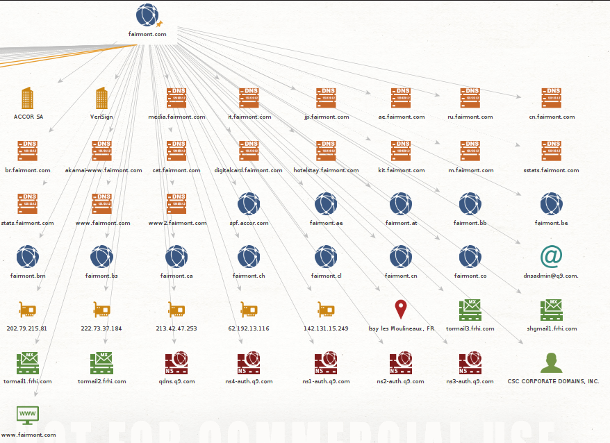
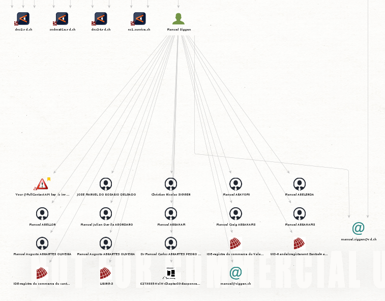
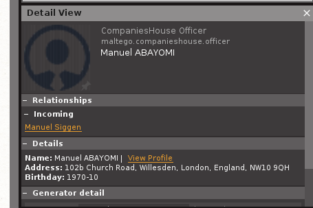
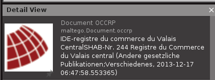
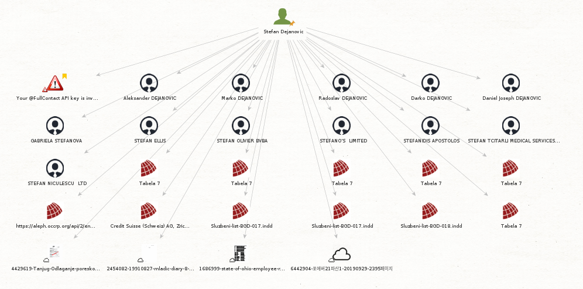
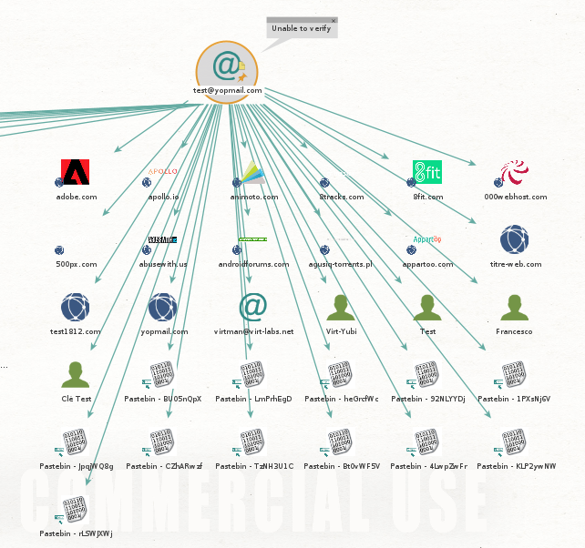

# SEN - Laboratoire Maltego

## Auteur : Edin Mujkanovic

### 1. Exercice 1

Ci-dessous, une capture d'écran d'une partie de la carte présentant ma première recherche basée sur le nom de domaine `fairmont.com`. La carte entière est présente dans le dossier `maltego_maps`. 

Comme on peut le voir, il y a plusieurs informations qui sont affichées : 

- Deux entreprises : ACCOR SA, la chaîne à qui appartient Fairmont et VeriSign qui est probablement l'issuer des certificats de l'entreprise.
- Différentes entrées DNS ( par ex : media.fairmont.com)
- Les différents noms de domaine qui lui sont rattaché (par ex : fairmont.ae)
- Des adresses IPs (par ex : 202.79.215.91)
- Une adresse (Issy les Moulineau, FR) 
- Les entrées MX du DNS (par ex : tormail2.frhi.com)
- Les entrées NS du DNS (par ex : qdns.q9.com)
- Une personne (CSC CORPORATE DOMAINS, INC.) qui je suppose est le contact pour toute la gestion des domaines.
- Un site web (www.fairmont.com)

### 2. Exercice 2

Dans cet exercice, j'ai effectué des recherches sur une personne. Etant donné que la personne de l'exercice 1 n'était surement pas une personne physique, j'ai changé de nom de domaine pour vd.ch. Il faut aussi savoir que différents transforms on été installé entre temps.

Cmme nous pouvns le voir, nous avons deux adresses emails lui appartenant. Mais surtout différentes personnes qui sont en relation avec lui. Fait très intéressant, nous avons réussi à obtenir leur adresse email pour certain, et même leur date de naissance : 

Nous avons aussi trouvé d'autre document qui lui étaient liés : 

### 3. Exercice 3

Ci-dessous, une capture d'écran présentant une partie de la recherche en se basant sur une personne. n peut voir des potentielles relations ainsi que différents potentiels documents.

Ci-dessous, une partie de la carte des résultats basé sur une adresse email jetable. On peut remarquer plusieurs sites qui ont été repertoriés et dont le compte a été compromis. Des adresses emails, des personnes potentielles ainsi que des liens vers le site pastebin.

### 4. Conclusion

On peut remarquer que `Maltego` fournit de bonnes informations sur les DNS, et autres reconnaissances de points d'entrées. Par contre, par rapport aux personnes, il y a beaucoup de faux positifs et donc les informations sont peu pertinantes. Je pense que l'outil est donc surtout utile pour la reconnaissance de réseau, découvertes d'hôtes, etc.

